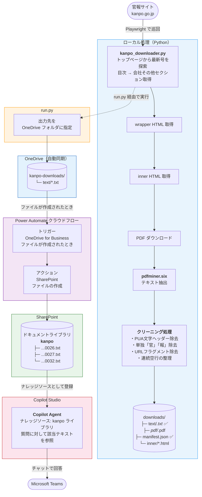

# 官報テキスト抽出 → SharePoint → Copilot Agent フロー図



## 各コンポーネントの役割

| コンポーネント | 役割 | ファイル |
|---|---|---|
| `kanpo_downloader.py` | 官報サイト巡回・PDF取得・テキスト抽出・クリーニング | `kanpo/kanpo_downloader.py` |
| `run.py` | OneDrive フォルダを出力先にして downloader を実行 | `kanpo/run.py` |
| OneDrive 同期 | ローカルファイルをクラウドへ自動同期 | OS の OneDrive クライアント |
| Power Automate | OneDrive の新規ファイルを SharePoint へ転送 | `kanpo/PowerAutomate.md` 参照 |
| SharePoint ライブラリ `kanpo` | Copilot Studio のナレッジソース置き場 | — |
| Copilot Studio | テキストを読み込み Teams チャットで回答 | — |

## 実行コマンド

```powershell
# 通常実行（OneDrive へ保存）
cd C:\Users\Owner\tools
kanpo\.venv\Scripts\python kanpo\run.py

# ページ数を制限してテスト
kanpo\.venv\Scripts\python kanpo\run.py --max-pages 1
```
